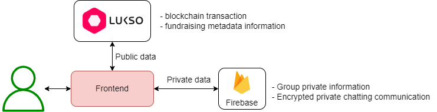

=======================================

# Bitvia, one DApp to Build and Grow powerful Web3 Communities in a decentralized way

On Bitvia you will find everything you need to connect to your fans, interact with them and let them support you. Powered by the possibilites of Web3, you have all the tools at your disposal to expand your fan base and distribute your ideas. No matter where you are on your creative journey, there should be no boundaries. Enjoy complete creative control.

Check it out: Youtube link here!

# Team

Sandro Rüttimann - sr_social@outlook.com

Roger Heines - roger.heines@gmail.com

Van Thanh Le - levanthanh3005@gmail.com

# Getting Started

## General architecture



We store private data in our encrypted private database, for example, the data from the chat app and the information from the private groups. Other general information that needs to be public and traceable is stored in the Lukso blockchain via a smart contract transaction. This secures all private data, while the activities from the fundraising process can be tracked publicly.

We use the following parts of the Lukso Blockchain:

- Integration of Universal Profiles (UPs) for the Login
- Show the assets of a UP in the application
- Send LXYe token between UPs
- Send a token (LSP7) to another UP
- Send a NFTs (LSP8) to another UP
- Token-based access to a private group
- Use LXYe tokens to fund a campaign (fundraising campaign)
- Interaction with UniversalPage to mint tokens and NFTs

## Smart contract

Our smart contract is developed and tested in [here](/smartcontract)

## Frontend

### Prepare .env file


### Install the dependencies and run the development server

```bash
npm install
npm start
# or
yarn
yarn start
```

### Or run with Docker

Build docker image:

```bash
docker build -t fundraisingfrontend .
#Run and debug:
docker run -d \
  -p 3000:3000 \
  --name fundraisingfrontend \
  fundraisingfrontend
```

## Backend

### Install the dependencies and run the development server

```bash
npm install
npm start
# or
yarn
yarn start
```

### Or run with Docker

Build docker image:

```bash
docker build -t fundraisingdb .

docker run -d \
  --name fundraisingdb \
  fundraisingdb
```

# RoadMap

Phase 1: Add more Core Features

- Profile Management: Allow users to create and manage their own profiles in Bitvia
- Social Media Feed: Develop a basic feed system for users to post and interact with content
- Fundraising Campaign Creation: Enable users to create crowdfunding campaigns with more details

Phase 2: Enhanced User Experience

- Media Upload and Sharing: Allow users to upload and share various types of media, such as images and videos
- Community Forums: Add discussion forums to encourage community interaction and support
- Real-time Notifications: Integrate real-time notifications for actions like likes, comments, and campaign update
- Enhanced Campaign Management: Expand campaign management features
- Extended Crowdfunding Features: Introduce advanced crowdfunding options, like flexible funding models, stretch goals, and equity crowdfunding
- Collaboration Features: Implement features to facilitate collaboration between users on projects and campaigns

Phase 3: Security and Compliance

- Security: Add more layers for encryption to ensure user data and transactions are secured end-to-end
- Compliance with Regulations: Compliance with Regulations
- Bug Fixes and Stability: Address any security vulnerabilities, bugs, and stability issues
